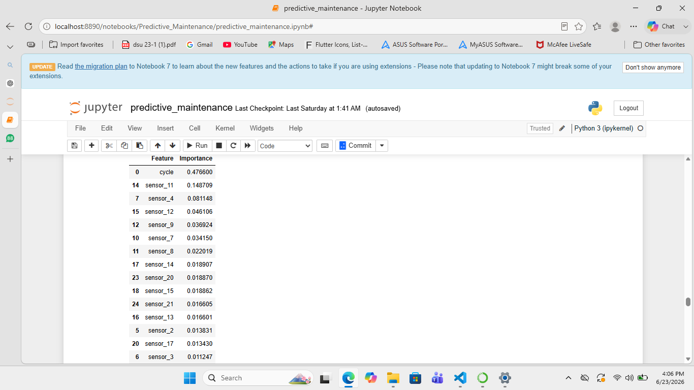
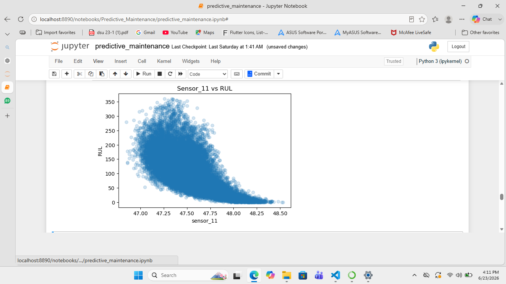
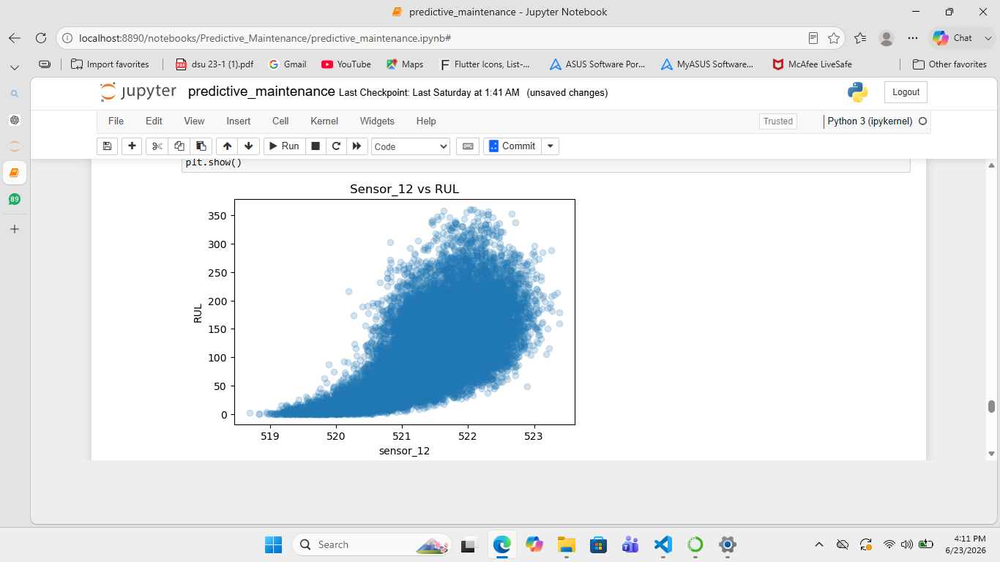
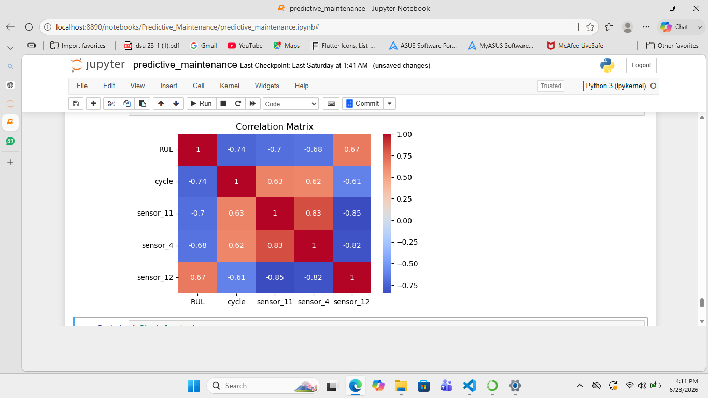

# Predictive Maintenance using NASA Turbofan Engine Dataset

## Project Overview

This project predicts the Remaining Useful Life (RUL) of aircraft engines using sensor readings and operational settings from the NASA Turbofan Engine Degradation Dataset.

The objective is to estimate how many operating cycles remain before an engine fails, enabling proactive maintenance, reducing downtime, and improving operational reliability.

---

## Business Problem

Unexpected engine failures can lead to:

- Increased maintenance costs
- Operational downtime
- Safety risks
- Production losses

This project helps estimate engine health and predict the remaining cycles before failure, enabling predictive maintenance and better resource planning.

---

## Dataset

**NASA CMAPSS Turbofan Engine Degradation Dataset (FD001)**

### Features

- Engine ID
- Cycle Number
- 3 Operational Settings
- 21 Sensor Measurements

### Target Variable

- Remaining Useful Life (RUL)

---

## Project Workflow

1. Data Loading and Understanding
2. Data Preprocessing
3. Remaining Useful Life (RUL) Calculation
4. Exploratory Data Analysis (EDA)
5. Feature Importance Analysis
6. Correlation Analysis
7. Model Training
8. Model Evaluation
9. Model Comparison

---

## Models Used

- Linear Regression
- Random Forest Regressor
- XGBoost Regressor

---

## Model Performance

| Model | RMSE |
|---------|---------|
| Linear Regression | 39.23 |
| Random Forest Regressor | 35.97 |
| XGBoost Regressor | 35.83 |

### Best Model

**XGBoost Regressor** achieved the lowest RMSE and delivered the best predictive performance for Remaining Useful Life (RUL) estimation.

---

## Key Insights

- Cycle number was the most influential feature.
- Sensor 11 showed a strong negative correlation with RUL.
- Sensor 4 showed a strong negative correlation with RUL.
- Sensor 12 showed a strong positive correlation with RUL.
- Tree-based models outperformed Linear Regression.
- Engine ID was excluded from final analysis because it acts as an identifier rather than a meaningful predictive feature.

---

## Visualizations









---

## Technologies Used

- Python
- Pandas
- NumPy
- Matplotlib
- Scikit-Learn
- XGBoost
- Jupyter Notebook

---

## Business Impact

This solution can help organizations:

- Predict engine failures before breakdown
- Reduce maintenance costs
- Minimize operational downtime
- Improve equipment reliability
- Enable predictive maintenance scheduling

---

## Repository Structure

```text
predictive-maintenance-rul-prediction/
│
├── Data/
│   ├── train_FD001.txt
│   ├── test_FD001.txt
│   └── RUL_FD001.txt
│
├── images/
│   ├── features_importance.png
│   ├── sensor11_vs_rul.png
│   ├── sensor12_vs_rul.png
│   └── correlation_matrix.png
│
└── predictive_maintenance.ipynb
```

---

## Author

**Faisal**

Aspiring Data Scientist | Machine Learning Enthusiast

GitHub: https://github.com/faisal-ai-ds
